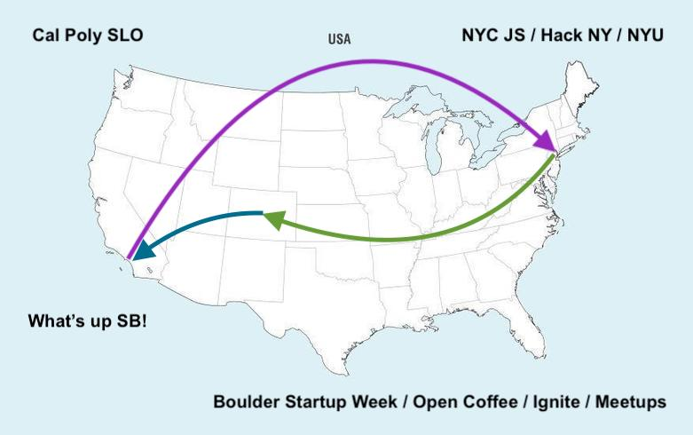
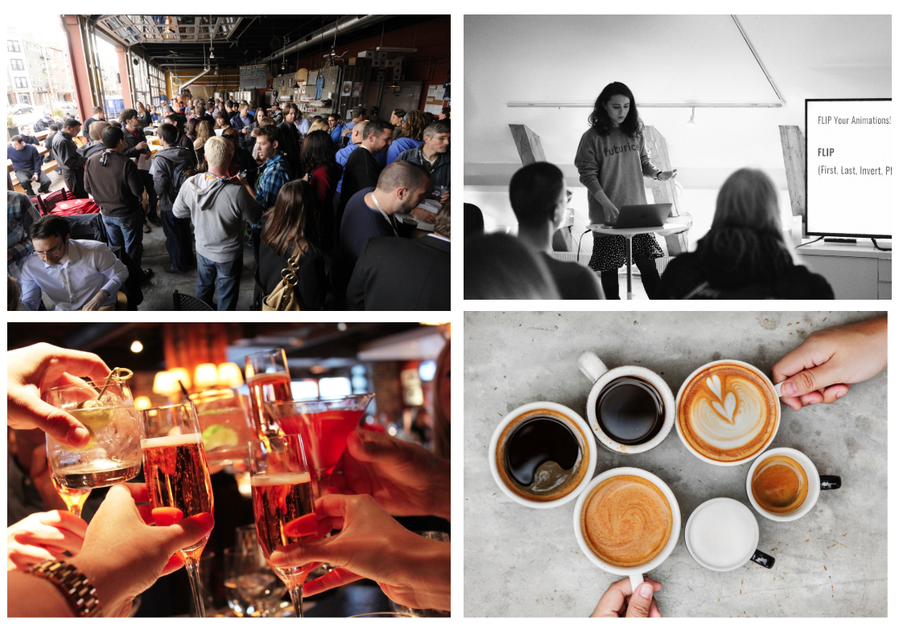

build-lists: true

# We **nerd** community

---

# My journey

---

# Computer lab friends

---

# Intimidation at NYC meetups

---

# Friendly Boulder people

---

# A blood pact at SB JS

- Maybe mention other people's names you met that night
- Say you embarrassingly took notes and was so excited

---

# 4 months later, we are up here giving lighting talks, and it means the world to me

---

# Why does it "mean the world to me" 🤔 

- These people become actual friends in real life
- Good for mental and emotional health
- Share perspectives and help each other learn
- The whole is greater than the sum of its parts

---

# So what are your most favorite or least favorite things about tech community in SB?

---

# Some ideas...

----

# Some questions..

- Geographic challenges
- Is the focus tech, startups, or something else?

----

# In conclusion:
# We definitely **nerd** community!